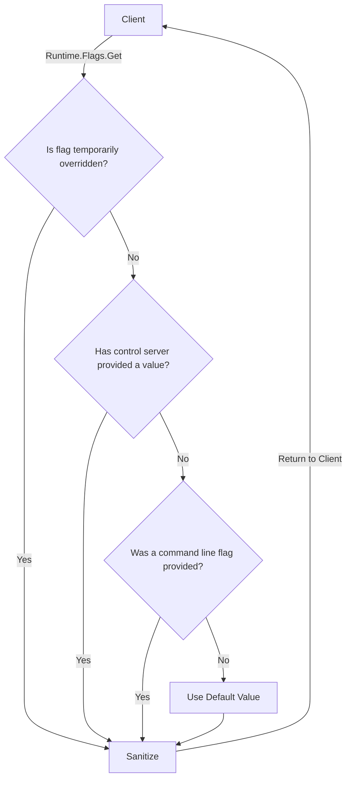
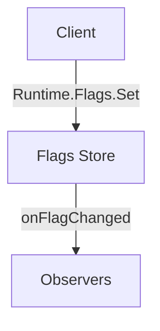

# Runtime.Flags

## Getting Flags

```mermaid
flowchart TB
    A[Client]
    C[Use Default Value]
    D[Sanitize]
    E{Is flag temporarily overridden?}
    F{Has control server provided a value?}
    G{Was a command line flag provided?}

    A -->|Runtime.Flags.Get| E
    E -->|Yes| D
    E -->|No| F

    F -->|Yes| D
    F -->|No| G

    G -->|Yes| D
    G -->|No| C

    C --> D

    D -->|Return to Client| A

```

## Setting Flags

```mermaid
flowchart TB
    A[Client]
    B[Flags Store]
    C[Observers]

    A -->|Runtime.Flags.Set|B
    B -->|onFlagChanged|C
```