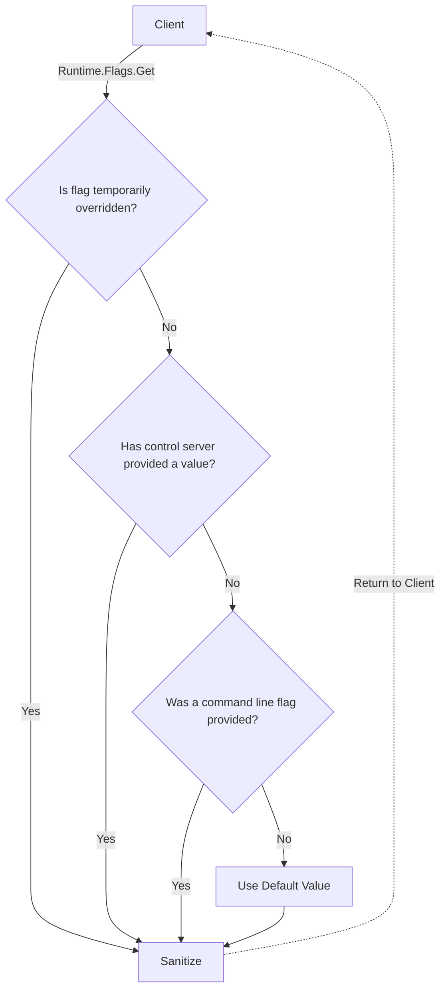
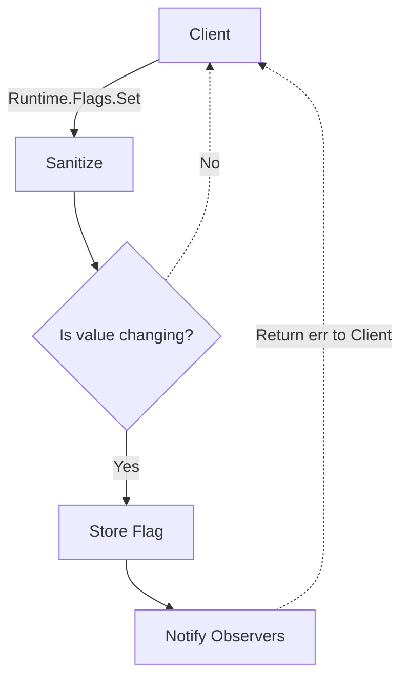
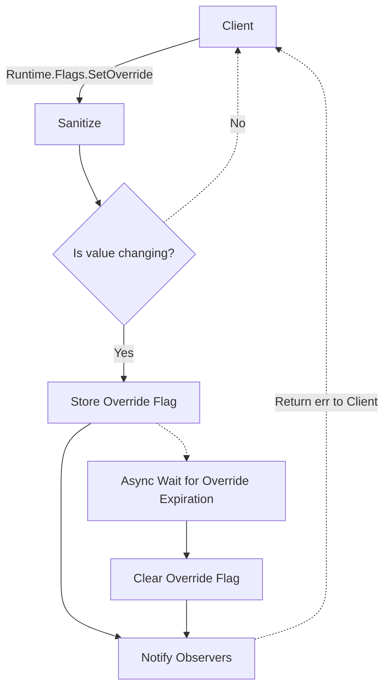

# Runtime.Flags

## Getting Flags

```mermaid
flowchart TB
    A[Client]
    C[Use Default Value]
    D[Sanitize]
    E{Is flag temporarily overridden?}
    F{Has control server provided a value?}
    G{Was a command line flag provided?}

    A -->|Runtime.Flags.Get| E
    E -->|Yes| D
    E -->|No| F

    F -->|Yes| D
    F -->|No| G

    G -->|Yes| D
    G -->|No| C

    C --> D

    D -.->|Return to Client| A

```

## Setting Flags

```mermaid
flowchart TB
    A[Client]
    B[Store Flag]
    C[Notify Observers]
    D[Sanitize]
    E{Is value changing?}

    A -->|Runtime.Flags.Set|D
    D -->E

    E -->|Yes| B
    E -.->|No| A

    B --> C

    C -.->|Return err to Client| A
```

## Setting Temporary Overrides

```mermaid
flowchart TB
    A[Client]
    B[Store Override Flag]
    C[Notify Observers]
    D[Sanitize]
    E{Is value changing?}
    F[Async Wait for Override Expiration]
    G[Clear Override Flag]

    A -->|Runtime.Flags.SetOverride|D
    D -->E

    E -->|Yes| B
    E -.->|No| A

    B -.-> F
    B --> C

    F -->G
    G -->C

    C -.->|Return err to Client| A
```