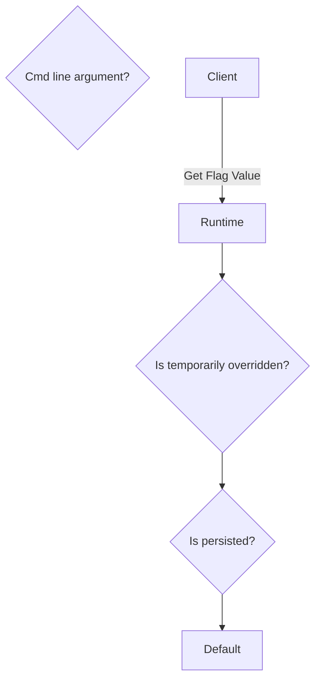
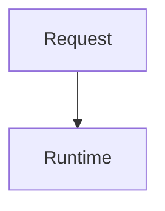

# Runtime

## Getting Flags

```mermaid
flowchart TB
    tempOverride{Is temporarily overridden?}
    persisted{Is persisted?}
    cmd{Cmd line argument?}

    Client -->|Get Flag Value|Runtime

    Runtime --> tempOverride

    tempOverride --> persisted

    persisted --> Default
```

## Setting Flags

```mermaid
flowchart TB
    Request --> Runtime
```